# mcp-obs Architecture Flow Diagrams

## Overview

**mcp-obs** is the "Auth0 + OpenTelemetry for MCP servers" - a comprehensive Next.js application that provides enterprise-grade authentication proxy and observability infrastructure for Model Context Protocol (MCP) servers.

## Core Business Value Proposition

1. **Authentication as a Service**: Enable companies to add OAuth-based authentication to their MCP servers without building auth infrastructure
2. **Comprehensive Observability**: OpenTelemetry-based telemetry collection, analysis, and export for complete MCP server monitoring
3. **Enterprise-Grade Security**: Multi-tenant isolation, secure token management, and comprehensive audit trails

---

## 1. High-Level System Architecture

```mermaid
graph TB
    %% External Users and Systems
    Customer["👤 Customer<br/>Organization Admin"]
    EndUser["👤 End User<br/>MCP Client User"]
    MCPClient["🔌 MCP Client<br/>Claude Desktop, etc."]
    MCPServer["🤖 Customer's MCP Server<br/>with mcp-obs SDK"]

    %% mcp-obs Core Platform
    subgraph MCPObs ["🏢 mcp-obs Platform"]
        %% Dashboard System
        subgraph Dashboard ["📊 Dashboard - Platform Auth"]
            WebApp["🌐 Next.js Dashboard<br/>:3000"]
            PlatformAuth["🔐 Platform Auth<br/>Better Auth"]
            OrganizationMgmt["🏢 Multi-tenant<br/>Organization Management"]
        end

        %% OAuth Proxy System
        subgraph OAuthProxy ["🔐 OAuth Proxy System - Subdomain Based"]
            SubdomainRouter["🎯 Subdomain Router<br/>server.mcp-obs.com"]
            OAuthEndpoints["🔐 OAuth Endpoints<br/>/mcp-auth/oauth/*"]
            TokenValidation["🛡️ Token Validation<br/>API Key Management"]
        end

        %% Telemetry System
        subgraph TelemetrySystem ["📊 Telemetry & Observability"]
            TelemetryIngestion["📥 OTEL Collector<br/>Trace/Metric Ingestion"]
            TelemetryAnalytics["📈 Analytics Engine<br/>Real-time Processing"]
            TelemetryExport["📤 OTLP Exporter<br/>Customer Integration"]
        end

        %% Support Systems
        subgraph SupportSystems ["🛠️ Support Systems"]
            SupportTickets["🎫 Support Tickets<br/>Issue Management"]
            APIKeyMgmt["🔑 API Key Management<br/>Token Generation"]
            ConfigMgmt["⚙️ Server Configuration<br/>Settings Management"]
        end

        %% Infrastructure
        subgraph Infrastructure ["🔧 Infrastructure"]
            Database["🗄️ PostgreSQL<br/>Drizzle ORM"]
            oRPCLayer["🔄 oRPC Layer<br/>Type-safe APIs"]
            AuthStorage["🔐 Secure Token Store<br/>Encrypted Sessions"]
        end
    end

    %% External OAuth Providers
    OAuthProviders["🔐 OAuth Providers<br/>Google, GitHub, Custom"]

    %% Customer's Observability Stack
    CustomerObs["📊 Customer Observability<br/>Datadog, Grafana, etc."]

    %% Platform Connections
    Customer --> WebApp
    WebApp --> PlatformAuth
    PlatformAuth --> OrganizationMgmt
    OrganizationMgmt --> Database

    %% MCP Server Integration
    MCPServer --> TokenValidation
    MCPServer --> TelemetryIngestion
    EndUser --> MCPClient
    MCPClient --> MCPServer

    %% OAuth Flow
    MCPClient --> SubdomainRouter
    SubdomainRouter --> OAuthEndpoints
    OAuthEndpoints --> OAuthProviders
    OAuthEndpoints --> Database

    %% Support & Management
    WebApp --> SupportTickets
    WebApp --> APIKeyMgmt
    WebApp --> ConfigMgmt
    ConfigMgmt --> Database

    %% Telemetry Flow
    TelemetryIngestion --> TelemetryAnalytics
    TelemetryAnalytics --> Database
    TelemetryAnalytics --> TelemetryExport
    TelemetryExport --> CustomerObs

    %% Infrastructure Connections
    oRPCLayer --> Database
    AuthStorage --> Database
    TokenValidation --> AuthStorage

    classDef customer fill:#e1f5fe
    classDef platform fill:#f3e5f5
    classDef oauth fill:#e8f5e8
    classDef telemetry fill:#fff3e0
    classDef support fill:#f0f4ff
    classDef infra fill:#f5f5f5

    class Customer,EndUser,MCPClient,MCPServer customer
    class Dashboard,WebApp,PlatformAuth,OrganizationMgmt platform
    class OAuthProxy,SubdomainRouter,OAuthEndpoints,TokenValidation oauth
    class TelemetrySystem,TelemetryIngestion,TelemetryAnalytics,TelemetryExport telemetry
    class SupportSystems,SupportTickets,APIKeyMgmt,ConfigMgmt support
    class Infrastructure,Database,oRPCLayer,AuthStorage infra
```

---

## 2. Dual Authentication System Architecture

```mermaid
graph TB
    %% Users
    Customer["👤 Customer<br/>Organization Admin"]
    EndUser["👤 End User<br/>MCP Client User"]

    %% Platform Authentication
    subgraph PlatformAuth ["🔐 Platform Authentication System"]
        PlatformLogin["🌐 /login"]
        PlatformBetterAuth["⚙️ Better Auth Instance<br/>/api/auth/**"]
        PlatformDB[("📊 Platform Auth Schema<br/>• user<br/>• session<br/>• organization<br/>• member")]
        PlatformProviders["🔗 OAuth Providers<br/>• GitHub<br/>• Google<br/>• Email/Password"]
    end

    %% MCP Server Authentication (End-User)
    subgraph MCPAuth ["🔐 MCP Server Authentication System"]
        MCPOAuthEndpoints["🌐 /mcp-auth/oauth/**<br/>server.mcp-obs.com"]
        MCPTokenValidation["🛡️ Token Validation API<br/>/api/mcp-auth/validate"]
        MCPDB[("📊 MCP Auth Schema<br/>• mcp_server_user<br/>• mcp_server_session<br/>• mcp_server")]
        MCPProviders["🔗 OAuth Providers<br/>• Google<br/>• GitHub<br/>• Custom OAuth<br/>(per organization)"]
    end

    %% Dashboard Access
    subgraph Dashboard ["📊 Dashboard - Multi-tenant"]
        OrgContext["🏢 Organization Context<br/>requireSession() + org scope"]
        DashboardPages["📄 Dashboard Pages<br/>• MCP Servers<br/>• Telemetry<br/>• Support Tickets<br/>• API Keys"]
        ServerManagement["⚙️ MCP Server Management<br/>• Create/Edit Servers<br/>• OAuth Configuration<br/>• Telemetry Settings"]
    end

    %% MCP Server SDK Integration
    subgraph MCPServerSDK ["🤖 MCP Server SDK Integration"]
        CustomerMCPServer["🤖 Customer's MCP Server<br/>with mcp-obs SDK"]
        OAuthMiddleware["🔐 OAuth Middleware<br/>Token validation"]
        TelemetryInstrumentation["📊 Telemetry Instrumentation<br/>OpenTelemetry integration"]
        SDKConfig["⚙️ SDK Configuration<br/>API keys, endpoints"]
    end

    %% Flow connections
    Customer --> PlatformLogin
    PlatformLogin --> PlatformBetterAuth
    PlatformBetterAuth --> PlatformProviders
    PlatformBetterAuth --> PlatformDB
    PlatformBetterAuth --> OrgContext
    OrgContext --> DashboardPages
    DashboardPages --> ServerManagement

    EndUser --> MCPOAuthEndpoints
    MCPOAuthEndpoints --> MCPProviders
    MCPOAuthEndpoints --> MCPDB

    CustomerMCPServer --> MCPTokenValidation
    MCPTokenValidation --> MCPDB
    CustomerMCPServer --> OAuthMiddleware
    CustomerMCPServer --> TelemetryInstrumentation

    ServerManagement --> SDKConfig
    SDKConfig --> CustomerMCPServer

    %% Separation indicator
    PlatformAuth -.->|"🚫 COMPLETE ISOLATION"| MCPAuth

    classDef customer fill:#e1f5fe
    classDef platform fill:#f3e5f5
    classDef mcp fill:#e8f5e8
    classDef sdk fill:#fff3e0
    classDef separation fill:#ffebee,stroke:#f44336,stroke-width:3px,stroke-dasharray: 5 5

    class Customer,EndUser customer
    class PlatformAuth,PlatformLogin,PlatformBetterAuth,PlatformDB,PlatformProviders,Dashboard,OrgContext,DashboardPages,ServerManagement platform
    class MCPAuth,MCPOAuthEndpoints,MCPTokenValidation,MCPDB,MCPProviders mcp
    class MCPServerSDK,CustomerMCPServer,OAuthMiddleware,TelemetryInstrumentation,SDKConfig sdk
```

---

## 3. Subdomain-Based OAuth Proxy Flow

```mermaid
sequenceDiagram
    participant Client as 🔌 MCP Client
    participant MCPServer as 🤖 Customer MCP Server
    participant OAuthProxy as 🔐 mcp-obs OAuth Proxy
    participant DB as 🗄️ Database
    participant Provider as 🔐 OAuth Provider
    participant User as 👤 End User

    Note over Client,User: MCP Client attempts to connect to authenticated MCP server

    Client->>MCPServer: Connect to MCP server
    MCPServer->>MCPServer: mcp-obs SDK middleware<br/>detects unauthenticated request

    rect rgb(255, 248, 220)
        Note over MCPServer,DB: OAuth Discovery
        MCPServer->>OAuthProxy: GET /.well-known/oauth-authorization-server<br/>Host: docuapi.mcp-obs.com
        OAuthProxy->>DB: Resolve MCP server by subdomain<br/>SELECT * FROM mcp_server WHERE slug = 'docuapi'
        DB-->>OAuthProxy: Server config with OAuth settings
        OAuthProxy-->>MCPServer: OAuth metadata with proxy endpoints
        MCPServer-->>Client: OAuth authorization required<br/>with authorization_endpoint
    end

    rect rgb(240, 248, 255)
        Note over Client,Provider: Authorization Flow
        Client->>OAuthProxy: GET /mcp-auth/oauth/authorize<br/>Host: docuapi.mcp-obs.com
        OAuthProxy->>DB: Store authorization session with state
        OAuthProxy-->>User: Redirect to OAuth provider<br/>(Google, GitHub, etc.)

        User->>Provider: Login & authorize application
        Provider-->>OAuthProxy: GET /mcp-auth/oauth/callback<br/>?code=xyz&state=abc
    end

    rect rgb(240, 255, 240)
        Note over OAuthProxy,DB: Token Exchange & User Management
        OAuthProxy->>Provider: POST /oauth/token<br/>Exchange code for tokens
        Provider-->>OAuthProxy: {access_token, refresh_token, user_info}

        OAuthProxy->>DB: Upsert mcp_server_user<br/>Organization-scoped deduplication
        OAuthProxy->>DB: Create mcp_server_session<br/>with encrypted tokens
        OAuthProxy->>DB: Generate proxy authorization code
        OAuthProxy-->>Client: Redirect with authorization code
    end

    rect rgb(255, 240, 240)
        Note over Client,DB: Token Exchange for MCP Access
        Client->>OAuthProxy: POST /mcp-auth/oauth/token<br/>grant_type=authorization_code
        OAuthProxy->>DB: Validate & consume authorization code
        OAuthProxy->>DB: Generate access token for MCP access
        OAuthProxy-->>Client: {access_token, token_type, expires_in}
    end

    rect rgb(248, 240, 255)
        Note over Client,MCPServer: Authenticated MCP Requests
        Client->>MCPServer: MCP requests with<br/>Authorization: Bearer token
        MCPServer->>OAuthProxy: Validate token via mcp-obs SDK
        OAuthProxy->>DB: Resolve token → user context
        OAuthProxy-->>MCPServer: User validation response
        MCPServer-->>Client: MCP response with user tracking
    end

```

---

## 4. OpenTelemetry Integration & Telemetry Flow

```mermaid
graph TB
    %% MCP Server with SDK
    subgraph CustomerInfra ["🏢 Customer Infrastructure"]
        MCPServer["🤖 Customer MCP Server<br/>with mcp-obs SDK"]
        MCPServerTelemetry["📊 OTEL Instrumentation<br/>• Traces<br/>• Metrics<br/>• Logs"]
        SDKExporter["📤 OTLP Exporter<br/>to mcp-obs collector"]
    end

    %% MCP Client
    MCPClient["🔌 MCP Client<br/>Claude Desktop, etc."]

    %% mcp-obs Telemetry Infrastructure
    subgraph MCPObsTelemetry ["📊 mcp-obs Telemetry Platform"]
        %% Ingestion Layer
        subgraph IngestionLayer ["📥 Telemetry Ingestion"]
            OTLPCollector["🔄 OTLP Collector<br/>Next.js API endpoints"]
            TelemetryValidation["🛡️ API Key Validation<br/>Organization scoping"]
            TelemetryParser["⚙️ Data Parser<br/>Trace/Metric processing"]
        end

        %% Storage Layer
        subgraph StorageLayer ["🗄️ Telemetry Storage"]
            TelemetryDB[("📊 Telemetry Tables<br/>• telemetry_trace<br/>• telemetry_span<br/>• telemetry_metric<br/>• telemetry_log")]
            TimeSeriesIndex["⏱️ Time-series Indexes<br/>Performance optimization"]
        end

        %% Analytics Layer
        subgraph AnalyticsLayer ["📈 Analytics & Processing"]
            RealTimeAnalytics["⚡ Real-time Analytics<br/>Summary calculations"]
            AggregationEngine["🔄 Aggregation Engine<br/>• Tool usage stats<br/>• Performance metrics<br/>• Error rates"]
            DashboardQueries["📊 Dashboard Queries<br/>Organization-scoped data"]
        end

        %% Export Layer
        subgraph ExportLayer ["📤 Telemetry Export"]
            OTLPExporter["📤 OTLP Exporter<br/>JSON/Protobuf formats"]
            CustomerIntegrations["🔗 Customer Integrations<br/>• Datadog<br/>• Grafana<br/>• Custom endpoints"]
        end
    end

    %% Customer Observability Stack
    CustomerObservability["📊 Customer Observability<br/>Datadog, Grafana, etc."]

    %% Dashboard
    subgraph Dashboard ["📊 mcp-obs Dashboard"]
        TelemetryOverview["📈 Organization Overview<br/>• Cross-server metrics<br/>• Usage trends"]
        ServerAnalytics["🤖 Server-specific Analytics<br/>• Tool usage<br/>• Performance<br/>• Error analysis"]
        RealTimeDashboard["⚡ Real-time Dashboard<br/>• Live metrics<br/>• Time-range filtering"]
    end

    %% Data Flow
    MCPClient --> MCPServer
    MCPServer --> MCPServerTelemetry
    MCPServerTelemetry --> SDKExporter
    SDKExporter --> OTLPCollector

    OTLPCollector --> TelemetryValidation
    TelemetryValidation --> TelemetryParser
    TelemetryParser --> TelemetryDB
    TelemetryDB --> TimeSeriesIndex

    TelemetryDB --> RealTimeAnalytics
    RealTimeAnalytics --> AggregationEngine
    AggregationEngine --> DashboardQueries
    DashboardQueries --> TelemetryOverview
    DashboardQueries --> ServerAnalytics
    DashboardQueries --> RealTimeDashboard

    TelemetryDB --> OTLPExporter
    OTLPExporter --> CustomerIntegrations
    CustomerIntegrations --> CustomerObservability

    classDef customer fill:#e1f5fe
    classDef ingestion fill:#f0f8ff
    classDef storage fill:#fff8f0
    classDef analytics fill:#f0fff0
    classDef export fill:#f8f0ff
    classDef dashboard fill:#f3e5f5

    class MCPServer,MCPServerTelemetry,SDKExporter,MCPClient customer
    class IngestionLayer,OTLPCollector,TelemetryValidation,TelemetryParser ingestion
    class StorageLayer,TelemetryDB,TimeSeriesIndex storage
    class AnalyticsLayer,RealTimeAnalytics,AggregationEngine,DashboardQueries analytics
    class ExportLayer,OTLPExporter,CustomerIntegrations export
    class Dashboard,TelemetryOverview,ServerAnalytics,RealTimeDashboard dashboard
```

---

## 5. API Key Management & Security Flow

```mermaid
graph TB
    %% Users
    Customer["👤 Organization Admin"]
    MCPServer["🤖 Customer MCP Server"]

    %% API Key Management
    subgraph APIKeyMgmt ["🔑 API Key Management"]
        Dashboard["📊 Dashboard Interface<br/>API Key Management"]
        KeyGeneration["⚙️ Key Generation<br/>Secure random keys"]
        KeyStorage["🔒 Encrypted Storage<br/>bcrypt hashing"]
        KeyValidation["🛡️ Key Validation<br/>Authentication middleware"]
    end

    %% Security Features
    subgraph SecurityFeatures ["🛡️ Security Features"]
        OrganizationScoping["🏢 Organization Scoping<br/>Key isolation per org"]
        PermissionControl["🔐 Permission Control<br/>Telemetry vs Auth access"]
        AuditLogging["📋 Audit Logging<br/>Key usage tracking"]
        RateLimit["⚡ Rate Limiting<br/>API protection"]
    end

    %% Database Schema
    subgraph DatabaseSchema ["🗄️ Database Schema"]
        APIKeyTable[("🔑 mcp_server_api_key<br/>• id<br/>• mcp_server_id<br/>• key_hash<br/>• permissions<br/>• created_at<br/>• last_used_at")]
        MCPServerTable[("🤖 mcp_server<br/>• id<br/>• organization_id<br/>• slug<br/>• telemetry_enabled")]
        OrganizationTable[("🏢 organization<br/>• id<br/>• name<br/>• slug")]
    end

    %% Usage Flow
    Customer --> Dashboard
    Dashboard --> KeyGeneration
    KeyGeneration --> KeyStorage
    KeyStorage --> APIKeyTable

    MCPServer --> KeyValidation
    KeyValidation --> OrganizationScoping
    OrganizationScoping --> APIKeyTable
    APIKeyTable --> MCPServerTable
    MCPServerTable --> OrganizationTable

    KeyValidation --> PermissionControl
    KeyValidation --> AuditLogging
    KeyValidation --> RateLimit

    classDef user fill:#e1f5fe
    classDef management fill:#f3e5f5
    classDef security fill:#e8f5e8
    classDef database fill:#fff3e0

    class Customer,MCPServer user
    class APIKeyMgmt,Dashboard,KeyGeneration,KeyStorage,KeyValidation management
    class SecurityFeatures,OrganizationScoping,PermissionControl,AuditLogging,RateLimit security
    class DatabaseSchema,APIKeyTable,MCPServerTable,OrganizationTable database
```

---

## 6. Support Ticket System Flow

---

## 7. Data Architecture & Schema Overview

---

## Key Architectural Patterns

### 1. **Subdomain-Based Multi-Tenancy**
- Single platform serves multiple customer organizations via subdomain routing
- Each MCP server gets a unique subdomain (e.g., `docuapi.mcp-obs.com`)
- Complete data isolation between organizations through database scoping

### 2. **Dual Authentication Systems**
- **Platform Auth**: Customer organization management with Better Auth
- **MCP Server Auth**: End-user OAuth proxy for MCP server access
- Zero intersection between customer and end-user identity systems

### 3. **OAuth Proxy Architecture**
- mcp-obs acts as OAuth proxy between MCP clients and OAuth providers
- Never exposes upstream OAuth tokens to MCP clients or servers
- Organization-scoped user deduplication with secure token storage

### 4. **Comprehensive Telemetry Pipeline**
- OpenTelemetry-native instrumentation in customer MCP servers
- Real-time telemetry ingestion with organization-scoped validation
- Analytics engine for performance insights and usage patterns
- OTLP export to customer observability platforms

### 5. **SDK-First Integration**
- TypeScript and Python SDKs for seamless MCP server integration
- Transport-agnostic middleware (stdio, HTTP, SSE)
- Framework integrations (FastAPI, Flask, Express)

### 6. **Type-Safe API Layer with oRPC**
- End-to-end TypeScript safety from client to database
- Server actions with Zod validation and error handling
- Automatic cache revalidation after mutations

### 7. **Enterprise Security & Compliance**
- API key-based authentication for telemetry ingestion
- Encrypted token storage with bcrypt hashing
- Comprehensive audit logging and rate limiting
- Organization-scoped data access controls

This architecture enables mcp-obs to serve as a scalable, secure platform for adding authentication and observability to MCP servers, providing customers with enterprise-grade infrastructure without requiring them to build and maintain complex auth and telemetry systems.

---

## Technical Implementation Summary

- **Framework**: Next.js 15 with App Router
- **Database**: PostgreSQL with Drizzle ORM
- **Authentication**: Better Auth (dual instances for platform and MCP server auth)
- **Type Safety**: End-to-end TypeScript with oRPC and Zod validation
- **Observability**: OpenTelemetry with custom OTLP collector
- **Security**: Encrypted token storage, API key management, rate limiting
- **Multi-tenancy**: Organization-scoped data isolation
- **SDKs**: TypeScript and Python integration libraries
- **Infrastructure**: AWS deployment with SST framework