# MCPlatform Architecture Flow Diagrams

## Overview

MCPlatform is a multi-tenant SaaS platform that allows developer tools companies to create and manage MCP (Model Context Protocol) servers. These servers provide AI-powered assistance directly in development environments while enabling customer de-anonymization and engagement tracking.

## Core Business Value Proposition

1. **De-anonymization & User Insight**: Track interactions through unique IDs or OAuth flows to provide visibility into the previously opaque evaluation phase
2. **Enhanced Engagement & Activation**: Deliver interactive courses, tutorials, and proactive support directly into end-users' editors

---

## 1. High-Level System Architecture

```mermaid
graph TB
    %% External Users and Systems
    Customer["👤 Customer<br/>Developer Tools Company"]
    EndUser["👤 End User<br/>Developer"]
    MCPClient["🔌 MCP Client<br/>Claude Desktop, etc."]

    %% MCPlatform Core
    subgraph MCPlatform ["🏢 MCPlatform"]
        %% Dashboard System
        subgraph Dashboard ["📊 Dashboard - Platform Auth"]
            WebApp["🌐 Next.js Dashboard<br/>:3000"]
            PlatformAuth["🔐 Platform Auth<br/>Better Auth"]
            OrganizationMgmt["🏢 Multi-tenant<br/>Organization Management"]
        end

        %% MCP Server System
        subgraph MCPSystem ["🤖 MCP Server System - VHost Routing"]
            VHostRouter["🎯 VHost Router<br/>subdomain.mcplatform.com"]
            MCPHandler["⚡ MCP Handler<br/>Tool Execution"]
            MCPAuth["🔐 MCP Auth<br/>OAuth Proxy"]
        end

        %% Support Systems
        subgraph SupportSystems ["🛠️ Support Systems"]
            WalkthroughEngine["📚 Walkthrough Engine<br/>Interactive Tutorials"]
            SupportTools["🎫 Support Tools<br/>Ticket Management"]
            DocumentRetrieval["📄 Document Retrieval<br/>Knowledge Base"]
        end

        %% Infrastructure
        subgraph Infrastructure ["🔧 Infrastructure"]
            Database["🗄️ PostgreSQL<br/>Drizzle ORM"]
            Redis["⚡ Redis<br/>Caching"]
            S3["☁️ S3<br/>Document Storage"]
            Inngest["⚙️ Inngest<br/>Background Jobs"]
            TurboPuffer["🔍 TurboPuffer<br/>Vector Search"]
        end
    end

    %% External OAuth Provider
    OAuth["🔐 Customer OAuth Provider<br/>GitHub, Google, etc."]

    %% Connections
    Customer --> WebApp
    WebApp --> PlatformAuth
    PlatformAuth --> OrganizationMgmt
    OrganizationMgmt --> Database

    EndUser --> MCPClient
    MCPClient --> VHostRouter
    VHostRouter --> MCPHandler
    MCPHandler --> MCPAuth
    MCPAuth --> OAuth
    MCPAuth --> Database

    MCPHandler --> WalkthroughEngine
    MCPHandler --> SupportTools
    MCPHandler --> DocumentRetrieval

    WalkthroughEngine --> Database
    SupportTools --> Database
    DocumentRetrieval --> TurboPuffer
    DocumentRetrieval --> S3

    Inngest --> S3
    Inngest --> TurboPuffer
    Inngest --> Database

    MCPHandler --> Redis

    classDef customer fill:#e1f5fe
    classDef platform fill:#f3e5f5
    classDef mcp fill:#e8f5e8
    classDef support fill:#fff3e0
    classDef infra fill:#f5f5f5

    class Customer,EndUser customer
    class Dashboard,WebApp,PlatformAuth,OrganizationMgmt platform
    class MCPSystem,VHostRouter,MCPHandler,MCPAuth mcp
    class SupportSystems,WalkthroughEngine,SupportTools,DocumentRetrieval support
    class Infrastructure,Database,Redis,S3,Inngest,TurboPuffer infra
```



---

## 2. Dual Authentication System Architecture

```mermaid
graph TB
    %% Users
    Customer["👤 Customer<br/>Dashboard User"]
    EndUser["👤 End User<br/>Developer"]

    %% Platform Authentication
    subgraph PlatformAuth ["🔐 Platform Authentication System"]
        PlatformLogin["🌐 /login"]
        PlatformBetterAuth["⚙️ Better Auth Instance<br/>/api/auth/**"]
        PlatformDB[("📊 Platform Auth Schema<br/>• user<br/>• session<br/>• organization<br/>• member")]
        PlatformProviders["🔗 OAuth Providers<br/>• GitHub<br/>• Google<br/>• Email/Password"]
    end

    %% Sub-tenant Authentication
    subgraph MCPAuth ["🔐 Sub-tenant Authentication System"]
        MCPLogin["🌐 /mcp-oidc/login"]
        MCPBetterAuth["⚙️ Better Auth Instance<br/>/mcp-oidc/auth/**"]
        MCPDB[("📊 MCP Auth Schema<br/>• mcp_oauth_user<br/>• mcp_oauth_session<br/>• mcp_oauth_application")]
        MCPProviders["🔗 OAuth Providers<br/>• Google<br/>• Custom OAuth"]
    end

    %% Dashboard Access
    subgraph Dashboard ["📊 Dashboard - Multi-tenant"]
        OrgSelect["🏢 Organization Select<br/>/organization/select"]
        DashboardPages["📄 Dashboard Pages<br/>• MCP Servers<br/>• Walkthroughs<br/>• Users<br/>• Support Tickets"]
        RequireSession["🛡️ requireSession()<br/>Middleware"]
    end

    %% MCP Server Access
    subgraph MCPServer ["🤖 MCP Server - VHost Based"]
        MCPEndpoint["🎯 /api/mcpserver/**<br/>subdomain.mcplatform.com"]
        WithMCPAuth["🛡️ withMcpAuth()<br/>Middleware"]
        MCPTools["🔧 MCP Tools<br/>• Support<br/>• Walkthroughs<br/>• Custom"]
    end

    %% Flow connections
    Customer --> PlatformLogin
    PlatformLogin --> PlatformBetterAuth
    PlatformBetterAuth --> PlatformProviders
    PlatformBetterAuth --> PlatformDB
    PlatformBetterAuth --> RequireSession
    RequireSession --> OrgSelect
    OrgSelect --> DashboardPages

    EndUser --> MCPLogin
    MCPLogin --> MCPBetterAuth
    MCPBetterAuth --> MCPProviders
    MCPBetterAuth --> MCPDB

    EndUser --> MCPEndpoint
    MCPEndpoint --> WithMCPAuth
    WithMCPAuth --> MCPDB
    WithMCPAuth --> MCPTools

    %% Separation indicator
    PlatformAuth -.->|"🚫 NEVER INTERSECT"| MCPAuth

    classDef customer fill:#e1f5fe
    classDef platform fill:#f3e5f5
    classDef mcp fill:#e8f5e8
    classDef separation fill:#ffebee,stroke:#f44336,stroke-width:3px,stroke-dasharray: 5 5

    class Customer,EndUser customer
    class PlatformAuth,PlatformLogin,PlatformBetterAuth,PlatformDB,PlatformProviders,Dashboard,OrgSelect,DashboardPages,RequireSession platform
    class MCPAuth,MCPLogin,MCPBetterAuth,MCPDB,MCPProviders,MCPServer,MCPEndpoint,WithMCPAuth,MCPTools mcp
```



---

## 3. VHost-Based MCP Server Routing Flow

```mermaid
sequenceDiagram
    participant Client as 🔌 MCP Client
    participant VHost as 🎯 VHost Router
    participant DB as 🗄️ Database
    participant Handler as ⚡ MCP Handler
    participant Tools as 🔧 MCP Tools
    participant Auth as 🔐 Auth System

    Note over Client,Auth: Request arrives at subdomain.mcplatform.com

    Client->>VHost: GET /api/mcpserver/track123/mcp<br/>Host: acme-corp.mcplatform.com

    rect rgb(255, 248, 220)
        Note over VHost,DB: VHost Resolution Process
        VHost->>VHost: Extract Host header<br/>"acme-corp.mcplatform.com"
        VHost->>VHost: Parse subdomain<br/>"acme-corp"
        VHost->>VHost: Validate domain structure<br/>Must be direct subdomain
        VHost->>DB: SELECT * FROM mcp_servers<br/>WHERE slug = 'acme-corp'
        DB-->>VHost: Server configuration<br/>{id, authType, tools, etc.}
    end

    rect rgb(240, 248, 255)
        Note over VHost,Auth: User Tracking & Authentication
        VHost->>Auth: getAndTrackMcpServerUser()<br/>trackingId: "track123"
        Auth->>DB: Resolve user from:<br/>• OAuth session<br/>• Tracking ID<br/>• Email
        Auth->>DB: Create/update mcp_server_user
        Auth->>DB: Create/update mcp_server_session
        Auth-->>VHost: User context<br/>{userId, email, sessionId}
    end

    rect rgb(240, 255, 240)
        Note over VHost,Tools: MCP Handler Creation
        VHost->>Handler: createHandlerForServer()<br/>serverConfig + userContext
        Handler->>Handler: createMcpHandler()<br/>with Redis, logging

        alt authType includes 'oauth'
            Handler->>Auth: withMcpAuth() wrapper
        end

        Handler->>Tools: registerMcpServerToolsFromConfig()
        Tools->>Tools: Always register Support tool

        alt walkthroughToolsEnabled === 'true'
            Tools->>DB: Check for published walkthroughs
            alt Has walkthroughs
                Tools->>Tools: Register walkthrough tools
            end
        end

        Handler-->>VHost: Configured MCP handler
    end

    VHost->>Handler: Forward MCP request
    Handler->>Tools: Execute tool call
    Tools->>DB: Log tool_calls record
    Tools-->>Handler: Tool result
    Handler-->>VHost: MCP response
    VHost-->>Client: Response with<br/>Mcp-Session-Id header

    classDef process fill:#f0f8ff
    classDef auth fill:#f0fff0
    classDef data fill:#fff8f0
```

---

## 4. OAuth Proxy Flow for MCP Clients

```mermaid
sequenceDiagram
    participant Client as 🔌 MCP Client
    participant Platform as 🏢 MCPlatform
    participant User as 👤 End User
    participant Upstream as 🔐 Customer OAuth<br/>GitHub/Google/Custom
    participant DB as 🗄️ Database

    rect rgb(255, 248, 220)
        Note over Client,DB: 1. Client Discovery & Registration
        Client->>Platform: GET /.well-known/oauth-authorization-server<br/>Host: acme-corp.mcplatform.com
        Platform->>Platform: VHost lookup → MCP server config
        Platform-->>Client: OAuth metadata with proxy endpoints

        Client->>Platform: POST /oauth/register<br/>Dynamic Client Registration (RFC 7591)
        Platform->>DB: Store in mcp_client_registrations<br/>clientId: mcp_client_xyz
        Platform-->>Client: {client_id, client_secret}<br/>Proxy credentials
    end

    rect rgb(240, 248, 255)
        Note over Client,Upstream: 2. Authorization Flow
        Client->>Platform: GET /oauth/authorize<br/>client_id=mcp_client_xyz&redirect_uri=...
        Platform->>DB: Validate client registration
        Platform->>DB: Store authorization session with state
        Platform-->>User: Redirect to upstream OAuth<br/>https://github.com/login/oauth/authorize

        User->>Upstream: Login & authorize application
        Upstream-->>Platform: GET /oauth/callback?code=xyz&state=abc
    end

    rect rgb(240, 255, 240)
        Note over Platform,DB: 3. Token Exchange & User Creation
        Platform->>Upstream: POST /oauth/token<br/>Exchange code for upstream tokens
        Upstream-->>Platform: {access_token, refresh_token, expires_in}

        Platform->>Upstream: GET /userinfo<br/>Bearer upstream_access_token
        Upstream-->>Platform: {sub, email, name, ...}

        Platform->>DB: Create/update mcp_server_user<br/>Organization-scoped deduplication
        Platform->>DB: Store upstream_oauth_tokens<br/>Encrypted storage
        Platform->>DB: Generate proxy authorization code<br/>Links to user + tokens
        Platform-->>Client: Redirect with proxy auth code
    end

    rect rgb(255, 240, 240)
        Note over Client,DB: 4. Token Exchange
        Client->>Platform: POST /oauth/token<br/>grant_type=authorization_code
        Platform->>DB: Validate & consume auth code
        Platform->>DB: Generate proxy tokens<br/>mcp_at_xyz, mcp_rt_abc
        Platform->>DB: Store in mcp_proxy_tokens<br/>Links to upstream tokens
        Platform-->>Client: {access_token: "mcp_at_xyz"}<br/>NEVER exposes upstream tokens
    end

    rect rgb(248, 240, 255)
        Note over Client,Platform: 5. Authenticated MCP Requests
        Client->>Platform: MCP requests with<br/>Authorization: Bearer mcp_at_xyz
        Platform->>DB: Resolve proxy token → user context
        Platform-->>Client: MCP responses with user tracking
    end

    classDef discovery fill:#fff8f0
    classDef auth fill:#f0f8ff
    classDef tokens fill:#f0fff0
    classDef exchange fill:#fff0f0
    classDef requests fill:#f8f0ff
```

---

## 5. Interactive Walkthrough System Flow

```mermaid
graph TB
    %% Content Creation
    subgraph ContentCreation ["📝 Content Creation (Dashboard)"]
        Editor[✍️ Walkthrough Editor<br/>3-Panel Interface]
        StepEditor[📄 Step Editor<br/>• Agent Instructions<br/>• User Content<br/>• Operations]
        TemplateEngine[⚙️ Template Engine<br/>Structured Markdown]
    end

    %% Content Storage
    subgraph ContentStorage ["🗄️ Content Storage"]
        WalkthroughsDB[(📚 walkthroughs<br/>• title, type, status<br/>• organization_id)]
        StepsDB[(📋 walkthrough_steps<br/>• content_fields (v1)<br/>• display_order)]
        AssignmentsDB[(🔗 mcp_server_walkthroughs<br/>• server assignment<br/>• display_order)]
    end

    %% MCP Delivery
    subgraph MCPDelivery ["🤖 MCP Tool Delivery"]
        VHostRoute[🎯 VHost Routing<br/>subdomain.mcplatform.com]
        ToolRegistration[⚙️ Conditional Tool Registration<br/>walkthroughToolsEnabled]
        StartTool[🏁 start_walkthrough<br/>• List walkthroughs<br/>• Auto-start single<br/>• Restart option]
        NextStepTool[➡️ get_next_step<br/>• Mark complete<br/>• Find next step<br/>• Template render]
    end

    %% Progress Tracking
    subgraph ProgressTracking ["📊 Progress Tracking"]
        ProgressDB[(📈 walkthrough_progress<br/>• completed_steps[]<br/>• current_step_id)]
        CompletionsDB[(✅ walkthrough_step_completions<br/>• Analytics with context<br/>• Session tracking)]
        Analytics[📊 Analytics Engine<br/>• Time series<br/>• Sankey diagrams<br/>• Completion rates]
    end

    %% User Experience
    subgraph UserExperience ["👤 End User Experience"]
        MCPClient[🔌 MCP Client<br/>(Claude Desktop)]
        Agent[🤖 AI Agent<br/>Receives structured<br/>instructions]
        Developer[👤 Developer<br/>Gets guided<br/>experience]
    end

    %% Flow connections
    Editor --> StepEditor
    StepEditor --> TemplateEngine
    TemplateEngine --> WalkthroughsDB
    TemplateEngine --> StepsDB

    WalkthroughsDB --> AssignmentsDB
    AssignmentsDB --> VHostRoute
    VHostRoute --> ToolRegistration

    ToolRegistration -->|If enabled & has content| StartTool
    ToolRegistration -->|If enabled & has content| NextStepTool

    StartTool --> StepsDB
    NextStepTool --> StepsDB
    NextStepTool --> ProgressDB
    NextStepTool --> CompletionsDB

    StartTool --> MCPClient
    NextStepTool --> MCPClient
    MCPClient --> Agent
    Agent --> Developer

    CompletionsDB --> Analytics
    ProgressDB --> Analytics

    %% Progress loop back to tools
    Developer -.->|Completes steps| NextStepTool
    NextStepTool -.->|Updates progress| ProgressDB

    classDef creation fill:#e8f5e8
    classDef storage fill:#f0f8ff
    classDef delivery fill:#fff8f0
    classDef tracking fill:#f8f0ff
    classDef user fill:#f0fff0

    class Editor,StepEditor,TemplateEngine creation
    class WalkthroughsDB,StepsDB,AssignmentsDB storage
    class VHostRoute,ToolRegistration,StartTool,NextStepTool delivery
    class ProgressDB,CompletionsDB,Analytics tracking
    class MCPClient,Agent,Developer user
```

---

## 6. Dashboard User Workflow

```mermaid
stateDiagram-v2
    [*] --> LoginPage : Visit /login

    LoginPage --> Authentication : Social/Email Login
    Authentication --> RequireSession : Better Auth Validation

    RequireSession --> CheckOrganization : Validate Session

    state CheckOrganization {
        [*] --> HasActiveOrg
        HasActiveOrg --> [*] : ✅ Active Organization
        HasActiveOrg --> NoMemberships : ❌ No Active Org
        NoMemberships --> CreateOrg : No Memberships
        NoMemberships --> SelectOrg : Multiple Memberships
        CreateOrg --> [*] : New Org Created
        SelectOrg --> [*] : Organization Selected
    }

    CheckOrganization --> Dashboard : Organization Context Set

    state Dashboard {
        [*] --> Overview

        state MCPServers {
            [*] --> ListServers
            ListServers --> CreateServer : Add Server Button
            CreateServer --> ServerForm : Modal Opens
            ServerForm --> SlugValidation : Real-time Validation
            SlugValidation --> ServerCreated : Form Submit
            ServerCreated --> ServerDetails : Redirect
            ServerDetails --> [*]
        }

        state OAuthConfigs {
            [*] --> ListConfigs
            ListConfigs --> CreateConfig : Add Config Button
            CreateConfig --> ConfigForm : Modal Opens
            ConfigForm --> ConfigCreated : Form Submit
            ConfigCreated --> ListConfigs : Refresh
        }

        state Walkthroughs {
            [*] --> ListWalkthroughs
            ListWalkthroughs --> CreateWalkthrough : Create Button
            CreateWalkthrough --> WalkthroughEditor : 3-Panel Interface
            WalkthroughEditor --> EditSteps : Add/Edit Steps
            EditSteps --> PublishWalkthrough : Mark Published
            PublishWalkthrough --> AssignToServers : Assignment Modal
            AssignToServers --> [*]
        }

        state Users {
            [*] --> ListUsers
            ListUsers --> UserDetails : Click User
            UserDetails --> ViewSessions : Session History
            ViewSessions --> [*]
        }

        state SupportTickets {
            [*] --> ListTickets
            ListTickets --> TicketDetails : Click Ticket
            TicketDetails --> UpdateStatus : Status Change
            UpdateStatus --> AddComment : Add Activity
            AddComment --> [*]
        }

        Overview --> MCPServers
        Overview --> OAuthConfigs
        Overview --> Walkthroughs
        Overview --> Users
        Overview --> SupportTickets
    }
```



---

## 7. Data Flow Architecture

```mermaid
graph TD
    %% Input Sources
    subgraph InputSources ["📥 Input Sources"]
        CustomerDashboard[👤 Customer Dashboard<br/>Configuration & Management]
        EndUserMCP[👤 End User via MCP<br/>Tool Interactions]
        Documents[📄 Document Ingestion<br/>Knowledge Base Content]
    end

    %% Processing Layer
    subgraph ProcessingLayer ["⚙️ Processing Layer"]
        oRPCActions[🔄 oRPC Server Actions<br/>Type-safe mutations]
        MCPHandler[🤖 MCP Handler<br/>Tool execution]
        InngestJobs[⚙️ Inngest Jobs<br/>Background processing]
    end

    %% Core Database
    subgraph CoreDatabase ["🗄️ Core Database (PostgreSQL)"]
        PlatformTables[(🔐 Platform Auth<br/>• user<br/>• organization<br/>• session)]
        MCPAuthTables[(🔐 MCP Auth<br/>• mcp_oauth_user<br/>• mcp_oauth_session)]
        BusinessTables[(🏢 Business Logic<br/>• mcp_servers<br/>• walkthroughs<br/>• support_requests)]
        TrackingTables[(📊 Analytics<br/>• tool_calls<br/>• mcp_server_session<br/>• walkthrough_progress)]
        ContentTables[(📄 Content<br/>• documents<br/>• chunks<br/>• images)]
    end

    %% External Systems
    subgraph ExternalSystems ["☁️ External Systems"]
        Redis[(⚡ Redis<br/>Caching & Sessions)]
        S3[(☁️ S3<br/>Document Storage)]
        TurboPuffer[(🔍 TurboPuffer<br/>Vector Embeddings)]
        CustomerOAuth[🔐 Customer OAuth<br/>GitHub/Google/Custom]
    end

    %% Output Destinations
    subgraph OutputDestinations ["📤 Output Destinations"]
        DashboardUI[🖥️ Dashboard UI<br/>Real-time updates]
        MCPResponse[🤖 MCP Responses<br/>Tool results]
        Analytics[📊 Analytics<br/>Customer insights]
        SupportSystem[🎫 Support System<br/>Ticket management]
    end

    %% Data Flow Connections
    CustomerDashboard --> oRPCActions
    EndUserMCP --> MCPHandler
    Documents --> InngestJobs

    oRPCActions --> PlatformTables
    oRPCActions --> BusinessTables
    oRPCActions --> ContentTables

    MCPHandler --> MCPAuthTables
    MCPHandler --> TrackingTables
    MCPHandler --> BusinessTables
    MCPHandler --> CustomerOAuth

    InngestJobs --> ContentTables
    InngestJobs --> S3
    InngestJobs --> TurboPuffer

    MCPHandler --> Redis

    PlatformTables --> DashboardUI
    BusinessTables --> DashboardUI
    TrackingTables --> Analytics
    BusinessTables --> MCPResponse
    BusinessTables --> SupportSystem

    %% Cross-system data flows
    TurboPuffer -.-> MCPHandler
    S3 -.-> MCPHandler
    Redis -.-> MCPHandler

    classDef input fill:#e8f5e8
    classDef processing fill:#f0f8ff
    classDef database fill:#fff8f0
    classDef external fill:#f8f0ff
    classDef output fill:#f0fff0

    class CustomerDashboard,EndUserMCP,Documents input
    class oRPCActions,MCPHandler,InngestJobs processing
    class PlatformTables,MCPAuthTables,BusinessTables,TrackingTables,ContentTables database
    class Redis,S3,TurboPuffer,CustomerOAuth external
    class DashboardUI,MCPResponse,Analytics,SupportSystem output
```



---

## Key Architectural Patterns

### 1. **VHost-Based Multi-Tenancy**
- Single codebase serves multiple customers via subdomain routing
- `Host` header extraction determines MCP server configuration
- Database queries scoped by organization context

### 2. **Dual Authentication Systems**
- **Platform Auth**: Customer dashboard access with Better Auth
- **Sub-tenant Auth**: End-user OAuth proxy for de-anonymization
- Complete isolation between customer and end-user identity systems

### 3. **OAuth Proxy Architecture**
- Never exposes upstream OAuth tokens to MCP clients
- Proxy tokens (`mcp_at_*`, `mcp_rt_*`) map to stored upstream credentials
- Organization-scoped user deduplication prevents data leakage

### 4. **Promise-Based Data Loading**
- Server components pass promises to client components
- React 19 `use()` hook for progressive data loading
- Suspense boundaries with loading states

### 5. **Type-Safe RPC with oRPC**
- End-to-end TypeScript from client to database
- Server actions with input validation and error handling
- Automatic path revalidation after mutations

### 6. **Template-Driven Content Delivery**
- Structured markdown templates for AI agent consumption
- Version-controlled content schema (`v1`)
- Separation of agent instructions from user-facing content

### 7. **Comprehensive Analytics Tracking**
- Every user interaction logged with session context
- Time-series optimized indexes for dashboard analytics
- Sankey diagram support for walkthrough flow analysis

This architecture enables MCPlatform to serve as a scalable, secure, and observable platform for delivering AI-powered development assistance while providing customers with unprecedented visibility into user engagement and behavior.

---

## Technical Implementation Notes

- **Framework**: Next.js 15 with App Router
- **Database**: PostgreSQL with Drizzle ORM
- **Authentication**: Better Auth (dual instances)
- **Background Jobs**: Inngest
- **Caching**: Redis
- **Vector Search**: TurboPuffer
- **Storage**: S3
- **Type Safety**: End-to-end TypeScript with Zod validation