# User Tracking & Analytics Architecture

## Overview

mcp-obs implements a sophisticated dual-user tracking system that enables comprehensive analytics while maintaining OAuth authentication compatibility. This architecture provides complete user journey tracking, session management, and business intelligence across organizations and MCP servers.

---

## 🏗️ **Dual-User Architecture**

### **Design Philosophy**
mcp-obs uses **two separate user tables** to handle different concerns:

- **`mcp_end_user`**: Better Auth compatible table for OAuth authentication flows
- **`mcp_server_user`**: Analytics and business intelligence table for user capture and tracking

This separation enables:
- ✅ **Authentication Compatibility**: Seamless Better Auth integration
- ✅ **Analytics Power**: Complete user journey tracking across MCP servers
- ✅ **Organization Isolation**: Perfect multi-tenant data boundaries
- ✅ **Provider Flexibility**: Support for multiple OAuth providers

---

## 📊 **Table 1: `mcp_server_user` (Analytics & Business Logic)**

### **Purpose**
Core user capture table for analytics, deduplication, and business intelligence across organizations.

### **Schema Definition**
```sql
CREATE TABLE "mcp_server_user" (
    "id" text PRIMARY KEY NOT NULL,           -- Format: 'mcpu_' + nanoid()
    "tracking_id" text UNIQUE,                -- Analytics correlation ID
    "email" text,                             -- From OAuth provider (nullable)
    "upstream_sub" text,                      -- OAuth provider's 'sub' claim
    "profile_data" jsonb,                     -- Complete OAuth profile response
    "first_seen_at" bigint,                  -- Unix timestamp of first interaction
    "created_at" timestamp DEFAULT now(),
    "updated_at" timestamp DEFAULT now()
);
```

### **Field Explanations**

| Field | Purpose | Example | When Set |
|-------|---------|---------|----------|
| `id` | Primary key for internal references | `mcpu_abc123def456` | Auto-generated on insert |
| `tracking_id` | Analytics correlation across sessions | `track_xyz789` | Auto-generated, unique |
| `email` | User's email from OAuth provider | `john@company.com` | From OAuth profile |
| `upstream_sub` | OAuth provider's unique identifier | Google: `108123456789`, GitHub: `octocat` | From OAuth 'sub' claim |
| `profile_data` | Complete OAuth response | `{"name": "John", "avatar": "..."}` | Full provider response |
| `first_seen_at` | First interaction timestamp | `1703097600000` | Auto-generated on insert |

### **Record Creation Process**

**When Created**: During OAuth callback after successful authentication

**Location**: `packages/dashboard/src/app/api/oauth-callback/route.ts:229-240`

```typescript
// OAuth callback flow:
// 1. Receive authorization code from OAuth provider
// 2. Exchange code for access token with provider
// 3. Fetch user profile from provider
// 4. Create/update mcp_server_user record

const [newUser] = await db
  .insert(mcpServerUser)
  .values({
    email: profileData.email,
    upstreamSub: profileData.sub,        // Google: numbered ID, GitHub: username
    profileData: profileData,            // Complete OAuth response
    // id: auto-generated as 'mcpu_' + nanoid()
    // trackingId: auto-generated for analytics
    // firstSeenAt: auto-generated timestamp
  })
  .returning()
```

### **Organization-Scoped Deduplication Logic**

**Location**: `packages/dashboard/src/app/api/oauth-callback/route.ts:178-203`

```sql
-- Users are matched within organization boundaries only
SELECT * FROM mcp_server_user
JOIN mcp_server_session ON mcp_server_user.id = mcp_server_session.mcp_server_user_id
JOIN mcp_servers ON mcp_server_session.mcp_server_slug = mcp_servers.slug
WHERE mcp_servers.organization_id = $orgId
  AND (mcp_server_user.email = $email OR mcp_server_user.upstream_sub = $sub)
```

**Key Features**:
- ✅ **Provider Switching**: Matches by email OR upstream_sub
- ✅ **Organization Isolation**: Users completely isolated between organizations
- ✅ **Cross-Server Analytics**: Same user tracked across multiple MCP servers in organization

---

## 🔐 **Table 2: `mcp_end_user` (Better Auth Compatible)**

### **Purpose**
Better Auth compatible table for OAuth authentication flows and session management.

### **Schema Definition**
```sql
CREATE TABLE "mcp_end_user" (
    "id" uuid PRIMARY KEY DEFAULT gen_random_uuid(),
    "email" text,                             -- Nullable for Better Auth compatibility
    "email_verified" boolean DEFAULT false,
    "name" text,
    "image" text,
    "password_hash" text,                     -- For email/password auth
    "google_id" text,                         -- Google OAuth identifier
    "github_id" text,                         -- GitHub OAuth identifier
    "created_at" timestamp DEFAULT now(),
    "updated_at" timestamp DEFAULT now()
);
```

### **Field Explanations**

| Field | Purpose | Example | When Set |
|-------|---------|---------|----------|
| `id` | UUID primary key (Better Auth standard) | `550e8400-e29b-41d4-a716-446655440000` | Auto-generated UUID |
| `email` | User email (nullable for flexibility) | `john@company.com` | From OAuth provider |
| `email_verified` | Email verification status | `true` | From OAuth provider |
| `name` | Display name | `John Doe` | From OAuth provider |
| `image` | Avatar URL | `https://github.com/user.png` | From OAuth provider |
| `password_hash` | Hashed password (email/password auth) | `$2b$10$...` | Only for email signup |
| `google_id` | Google OAuth unique ID | `108123456789` | From Google OAuth |
| `github_id` | GitHub OAuth unique ID | `12345678` | From GitHub OAuth |

### **Record Creation Process**

**When Created**: During Better Auth user registration/OAuth flow

**Location**: `packages/dashboard/src/lib/auth/mcp/adapter.ts:23-42`

```typescript
// Better Auth adapter creates user during OAuth flow
const newUser = await db.insert(mcpEndUser).values({
  email: user.email,
  name: user.name || null,
  image: user.image || null,
  emailVerified: user.emailVerified || false,
  // OAuth provider IDs extracted from accounts
  googleId: user.accounts?.find(a => a.providerId === 'google')?.accountId,
  githubId: user.accounts?.find(a => a.providerId === 'github')?.accountId,
}).returning()
```

---

## 🎯 **Analytics Tracking: The Power of `tracking_id`**

### **Purpose of `tracking_id`**

The `tracking_id` field in `mcp_server_user` serves several critical analytics functions:

#### **1. Cross-Session Analytics Correlation**
```sql
-- Track user behavior across multiple sessions/devices
SELECT
  msu.tracking_id,
  COUNT(DISTINCT ms.id) as sessions_count,
  COUNT(mtc.id) as total_tool_calls,
  MIN(ms.created_at) as first_session,
  MAX(ms.created_at) as last_session
FROM mcp_server_user msu
JOIN mcp_server_session ms ON ms.mcp_server_user_id = msu.id
JOIN mcp_tool_calls mtc ON mtc.mcp_server_user_id = msu.id
GROUP BY msu.tracking_id;
```

#### **2. Anonymous-to-Authenticated User Bridging**
- Track usage before user completes OAuth flow
- Bridge anonymous sessions → authenticated user
- Enable complete user journey analysis

#### **3. External Analytics Integration**
```typescript
// Send to customer's analytics platforms (Mixpanel, Amplitude, etc.)
analytics.track(authContext.tracking_id, 'tool_called', {
  tool_name: 'search',
  server_slug: 'docuapi',
  user_id: authContext.user.id,  // Internal ID stays private
  organization: authContext.orgId
});
```

#### **4. Privacy-Safe User Identification**
- `tracking_id` is safe to share externally
- Actual user `id` remains internal to mcp-obs
- Enables analytics without exposing sensitive data

---

## 🔄 **Session Tracking Architecture**

### **Complete Data Flow**


### **Session → User → Server → Organization Chain**

```mermaid
graph TD
    A["🔄 mcp_server_session<br/>- id<br/>- mcp_server_user_id<br/>- mcp_server_slug<br/>- expires_at<br/>- oauth_provider"]

    B["👤 mcp_server_user<br/>- id (mcpu_xxx)<br/>- tracking_id<br/>- email<br/>- upstream_sub<br/>- profile_data"]

    C["🖥️ mcp_servers<br/>- id<br/>- slug<br/>- name<br/>- organization_id"]

    D["🏢 organization<br/>- id<br/>- name<br/>- billing_info"]

    E["📊 mcp_tool_calls<br/>- id<br/>- mcp_server_user_id<br/>- mcp_server_id<br/>- tool_name<br/>- created_at<br/>- metadata"]

    A --> B
    A --> C
    C --> D
    B --> E
    C --> E
```



### **Key Relationships**

```sql
-- Session links to user and server
mcp_server_session.mcp_server_user_id → mcp_server_user.id
mcp_server_session.mcp_server_slug → mcp_servers.slug

-- Server belongs to organization
mcp_servers.organization_id → organization.id

-- Tool calls reference user and server
mcp_tool_calls.mcp_server_user_id → mcp_server_user.id
mcp_tool_calls.mcp_server_id → mcp_servers.id

-- Better Auth bridge (via email matching)
mcp_end_user.email ≈ mcp_server_user.email
```

---

## 📈 **Analytics Capabilities & Queries**

### **1. Organization-Level Analytics**

```sql
-- Total sessions and users across all MCP servers in organization
SELECT
  o.name as organization_name,
  COUNT(DISTINCT mss.id) as total_sessions,
  COUNT(DISTINCT mss.mcp_server_user_id) as unique_users,
  COUNT(DISTINCT ms.id) as mcp_servers_deployed,
  COUNT(mtc.id) as total_tool_calls,
  AVG(mtc.response_time_ms) as avg_response_time
FROM organization o
JOIN mcp_servers ms ON ms.organization_id = o.id
JOIN mcp_server_session mss ON mss.mcp_server_slug = ms.slug
JOIN mcp_tool_calls mtc ON mtc.mcp_server_user_id = mss.mcp_server_user_id
WHERE mss.created_at >= '2024-01-01'
GROUP BY o.id, o.name
ORDER BY total_tool_calls DESC;
```

### **2. MCP Server Performance Analytics**

```sql
-- Performance metrics per MCP server
SELECT
  ms.name as server_name,
  ms.slug,
  COUNT(DISTINCT mss.id) as total_sessions,
  COUNT(DISTINCT mss.mcp_server_user_id) as unique_users,
  COUNT(mtc.id) as total_tool_calls,
  COUNT(mtc.id) / COUNT(DISTINCT mss.id)::float as avg_tools_per_session,
  -- Popular tools for this server
  jsonb_agg(
    DISTINCT jsonb_build_object(
      'tool', mtc.tool_name,
      'count', COUNT(mtc.tool_name)
    )
  ) as popular_tools
FROM mcp_servers ms
JOIN mcp_server_session mss ON mss.mcp_server_slug = ms.slug
JOIN mcp_tool_calls mtc ON mtc.mcp_server_user_id = mss.mcp_server_user_id
WHERE ms.organization_id = 'org_12345'
  AND mss.created_at >= '2024-01-01'
GROUP BY ms.id, ms.name, ms.slug
ORDER BY total_tool_calls DESC;
```

### **3. User Journey Analytics**

```sql
-- User behavior across multiple MCP servers in organization
SELECT
  msu.email,
  msu.tracking_id,
  msu.first_seen_at,
  COUNT(DISTINCT mss.mcp_server_slug) as servers_used,
  COUNT(mss.id) as total_sessions,
  COUNT(mtc.id) as total_tool_calls,
  -- First and last activity
  MIN(mss.created_at) as first_session,
  MAX(mss.created_at) as last_session,
  -- Most used tools
  jsonb_agg(
    DISTINCT mtc.tool_name ORDER BY mtc.tool_name
  ) as tools_used
FROM mcp_server_user msu
JOIN mcp_server_session mss ON mss.mcp_server_user_id = msu.id
JOIN mcp_servers ms ON ms.slug = mss.mcp_server_slug
JOIN mcp_tool_calls mtc ON mtc.mcp_server_user_id = msu.id
WHERE ms.organization_id = 'org_12345'
  AND mss.created_at >= '2024-01-01'
GROUP BY msu.id, msu.email, msu.tracking_id, msu.first_seen_at
ORDER BY total_tool_calls DESC;
```

### **4. Revenue Attribution Analytics**

```sql
-- Revenue calculation based on usage
SELECT
  o.name as customer,
  ms.name as mcp_server,
  DATE_TRUNC('month', mss.created_at) as month,
  COUNT(DISTINCT mss.mcp_server_user_id) as monthly_active_users,
  COUNT(mss.id) as sessions,
  COUNT(mtc.id) as tool_calls,
  -- Revenue calculations
  COUNT(DISTINCT mss.mcp_server_user_id) * 25 as subscription_revenue_usd,
  COUNT(mtc.id) * 0.01 as usage_revenue_usd,
  (COUNT(DISTINCT mss.mcp_server_user_id) * 25) + (COUNT(mtc.id) * 0.01) as total_revenue_usd
FROM organization o
JOIN mcp_servers ms ON ms.organization_id = o.id
JOIN mcp_server_session mss ON mss.mcp_server_slug = ms.slug
JOIN mcp_tool_calls mtc ON mtc.mcp_server_user_id = mss.mcp_server_user_id
WHERE mss.created_at >= '2024-01-01'
GROUP BY o.id, o.name, ms.id, ms.name, DATE_TRUNC('month', mss.created_at)
ORDER BY total_revenue_usd DESC;
```

### **5. Tool Popularity Analytics**

```sql
-- Most popular tools across all organizations
SELECT
  mtc.tool_name,
  COUNT(*) as total_calls,
  COUNT(DISTINCT mtc.mcp_server_user_id) as unique_users,
  COUNT(DISTINCT ms.organization_id) as organizations_using,
  AVG(mtc.response_time_ms) as avg_response_time,
  -- Success rate
  (COUNT(*) FILTER (WHERE mtc.success = true)::float / COUNT(*)) * 100 as success_rate
FROM mcp_tool_calls mtc
JOIN mcp_servers ms ON ms.id = mtc.mcp_server_id
WHERE mtc.created_at >= '2024-01-01'
GROUP BY mtc.tool_name
ORDER BY total_calls DESC;
```

---

## 💰 **Business Intelligence Use Cases**

### **1. Customer Success Metrics**
- **User Adoption**: Track user onboarding and engagement
- **Feature Usage**: Identify most/least popular tools
- **Retention**: Monitor user return rates and session frequency

### **2. Revenue Optimization**
- **Usage-Based Billing**: Accurate per-call billing with user attribution
- **Tier Analysis**: Identify users ready for premium upgrades
- **Cost Attribution**: Charge back AI costs to teams/departments

### **3. Product Analytics**
- **Tool Performance**: Response times, success rates, error patterns
- **User Behavior**: Tool usage patterns and workflows
- **A/B Testing**: Compare tool usage across different user segments

### **4. Enterprise Sales Support**
- **Usage Reports**: Detailed analytics for enterprise customers
- **ROI Demonstration**: Show productivity gains from AI tool usage
- **Compliance Auditing**: Complete audit trails for security teams

---

## 🔒 **Security & Privacy Features**

### **Organization Isolation**
- **All queries MUST include organization scoping**
- **Zero cross-contamination** between customer organizations
- **Complete data boundary enforcement** at database level

### **User Privacy Protection**
- **Tracking IDs** are safe for external analytics
- **Internal user IDs** never exposed outside mcp-obs
- **Profile data** stored in JSONB for flexible privacy controls

### **Data Retention Policies**
```sql
-- Configurable data retention per organization
DELETE FROM mcp_server_session
WHERE expires_at < NOW() - INTERVAL '90 days';

DELETE FROM mcp_tool_calls
WHERE created_at < NOW() - INTERVAL '2 years'
  AND mcp_server_id IN (
    SELECT id FROM mcp_servers
    WHERE organization_id = 'org_with_retention_policy'
  );
```

### **GDPR Compliance Support**
```sql
-- User data deletion for GDPR requests
DELETE FROM mcp_server_user
WHERE email = 'user@example.com'
  AND id IN (
    SELECT msu.id FROM mcp_server_user msu
    JOIN mcp_server_session mss ON mss.mcp_server_user_id = msu.id
    JOIN mcp_servers ms ON ms.slug = mss.mcp_server_slug
    WHERE ms.organization_id = 'requesting_org'
  );
```

---

## 📊 **Customer Dashboard Examples**

### **Organization Dashboard View**
```typescript
// What customers see in their analytics dashboard
const organizationAnalytics = {
  overview: {
    total_users: 145,
    active_sessions: 23,
    mcp_servers: 5,
    monthly_tool_calls: 12840
  },
  servers: [
    {
      name: 'Documentation Search',
      slug: 'docs-search',
      users: 89,
      sessions: 234,
      tool_calls: 5670,
      avg_response_time: '245ms'
    },
    {
      name: 'Code Assistant',
      slug: 'code-assist',
      users: 67,
      sessions: 189,
      tool_calls: 4320,
      avg_response_time: '380ms'
    }
  ],
  top_tools: [
    { name: 'search', calls: 3200, users: 78 },
    { name: 'generate', calls: 2890, users: 56 },
    { name: 'analyze', calls: 1750, users: 34 }
  ],
  user_engagement: [
    {
      email: 'john@company.com',
      sessions: 15,
      tools: 234,
      last_active: '2024-01-15T10:30:00Z'
    },
    {
      email: 'sarah@company.com',
      sessions: 22,
      tools: 445,
      last_active: '2024-01-15T14:45:00Z'
    }
  ],
  usage_trends: {
    daily_active_users: [23, 28, 31, 29, 35, 33, 37],
    tool_calls_per_day: [450, 523, 601, 587, 634, 612, 698],
    average_session_length: '8m 34s'
  }
};
```

### **MCP Server-Specific Analytics**
```typescript
// Server-specific metrics for customers
const serverAnalytics = {
  server_info: {
    name: 'Documentation Search',
    slug: 'docs-search',
    organization: 'TechCorp Inc',
    created: '2024-01-01'
  },
  usage_stats: {
    total_users: 89,
    total_sessions: 234,
    total_tool_calls: 5670,
    success_rate: 98.2,
    avg_response_time: '245ms'
  },
  tool_breakdown: [
    { tool: 'search', calls: 3200, success_rate: 99.1, avg_time: '180ms' },
    { tool: 'summarize', calls: 1500, success_rate: 97.8, avg_time: '420ms' },
    { tool: 'extract', calls: 970, success_rate: 98.9, avg_time: '290ms' }
  ],
  user_activity: {
    new_users_this_month: 12,
    returning_users: 77,
    power_users: 23,  // Users with >50 tool calls
    at_risk_users: 8   // Users inactive >7 days
  }
};
```

---

## 🚀 **Implementation Examples**

### **SDK Integration for Tracking**
```typescript
// Automatic tracking in mcp-obs SDK
import { McpObsSDK } from '@mcp-obs/server-sdk';

const mcpObs = new McpObsSDK({
  serverName: "your-server",
  oauthConfig: { serverSlug: "your-org" }
});

// Tool calls are automatically tracked
server.setRequestHandler(CallToolRequestSchema, async (request) => {
  const authContext = getAuthContext();

  // This call is automatically tracked in mcp_tool_calls table
  await mcpObs.trackAuthenticatedToolUsage(
    request.params.name,
    authContext,
    {
      sessionId: currentSessionId,
      responseTime: Date.now() - startTime,
      success: true,
      metadata: { custom: 'data' }
    }
  );

  return toolResult;
});
```

### **Custom Analytics Events**
```typescript
// Track custom business events
await mcpObs.trackCustomEvent('document_generated', {
  userId: authContext.user.id,
  trackingId: authContext.tracking_id,
  documentType: 'api_spec',
  wordCount: 2500,
  processingTime: 3200
});

// Track user journey milestones
await mcpObs.trackMilestone('first_successful_generation', {
  userId: authContext.user.id,
  timeToMilestone: Date.now() - authContext.firstSeenAt,
  serverSlug: 'code-assist'
});
```

---

## 📋 **Best Practices**

### **Query Performance**
1. **Always include organization scoping** in queries
2. **Use appropriate indexes** on frequently queried columns
3. **Partition large tables** by date for time-series analytics
4. **Cache dashboard queries** for better user experience

### **Data Privacy**
1. **Never expose internal user IDs** externally
2. **Use tracking IDs** for customer-facing analytics
3. **Implement data retention policies** per organization
4. **Support GDPR deletion requests** with cascading deletes

### **Analytics Architecture**
1. **Separate analytics from operational data** where possible
2. **Use read replicas** for heavy analytics queries
3. **Implement real-time streaming** for live dashboards
4. **Export to customer data warehouses** for advanced analytics

This user tracking and analytics architecture provides mcp-obs with comprehensive business intelligence capabilities while maintaining enterprise-grade security and privacy standards.