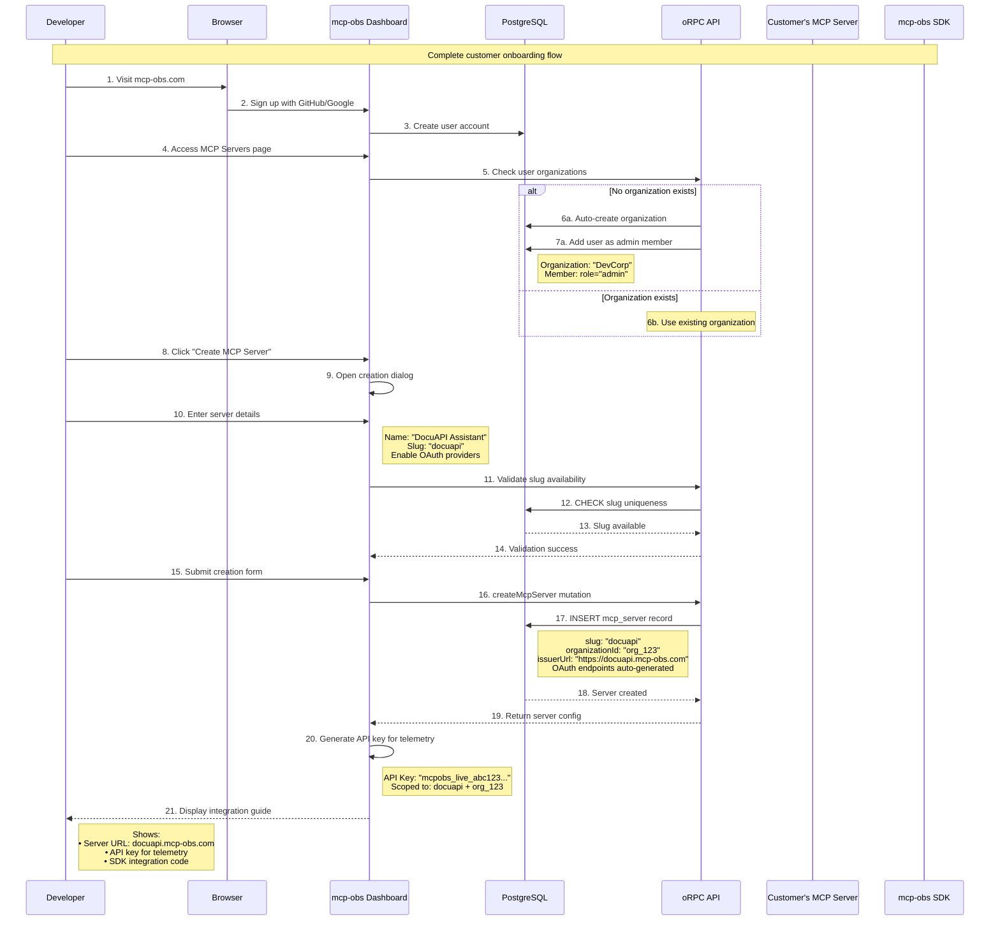
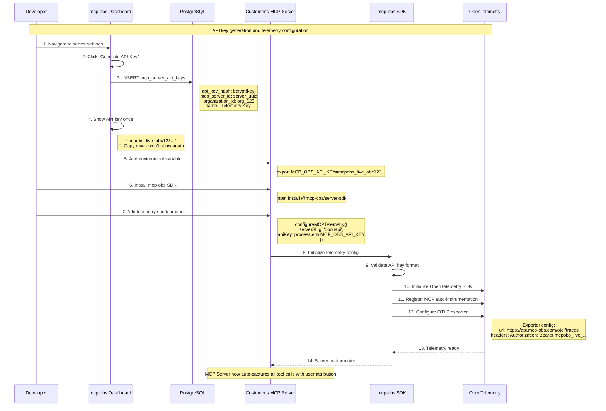
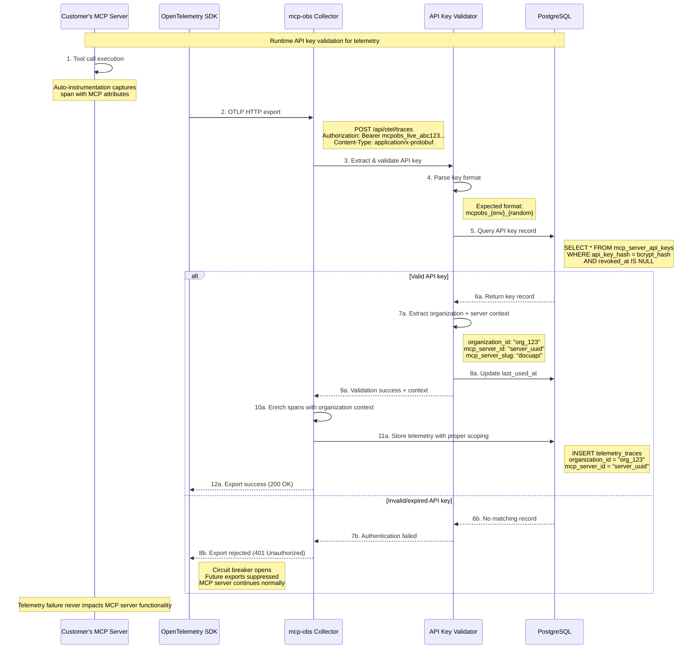
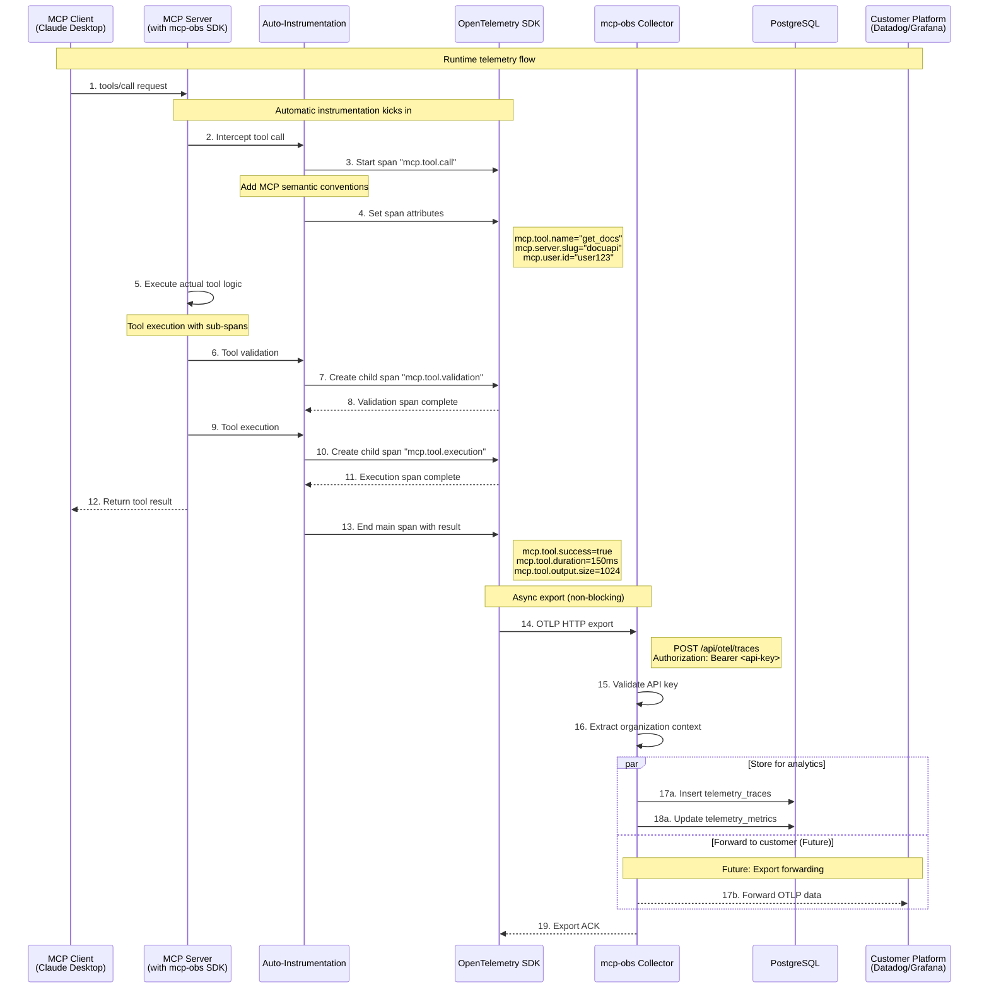
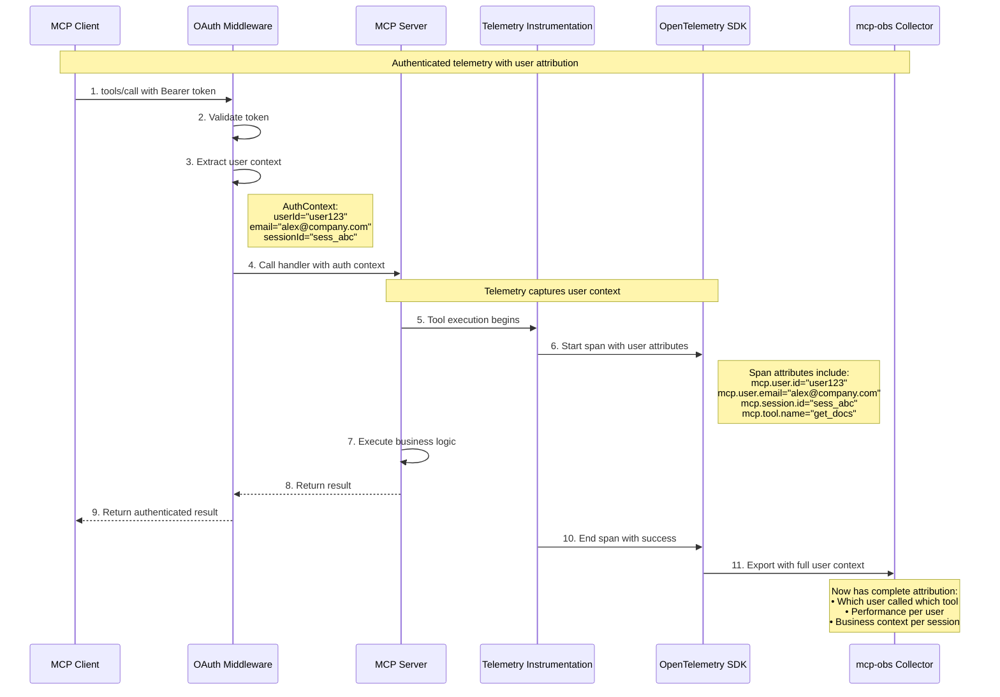
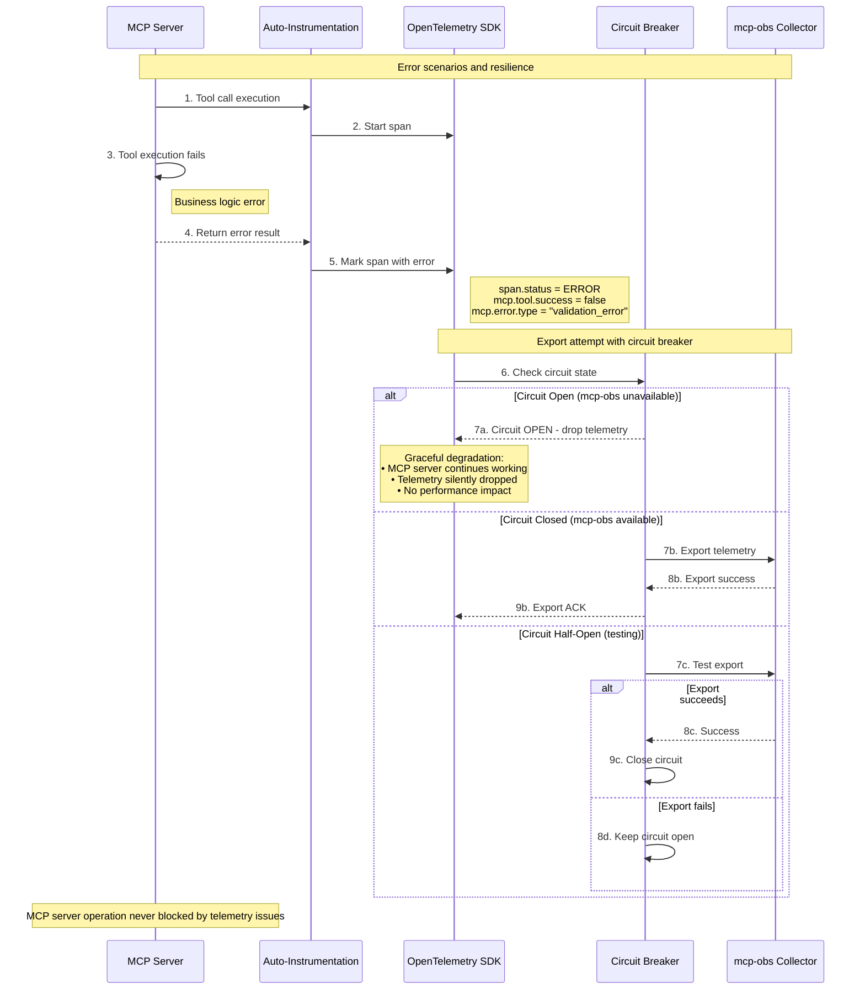
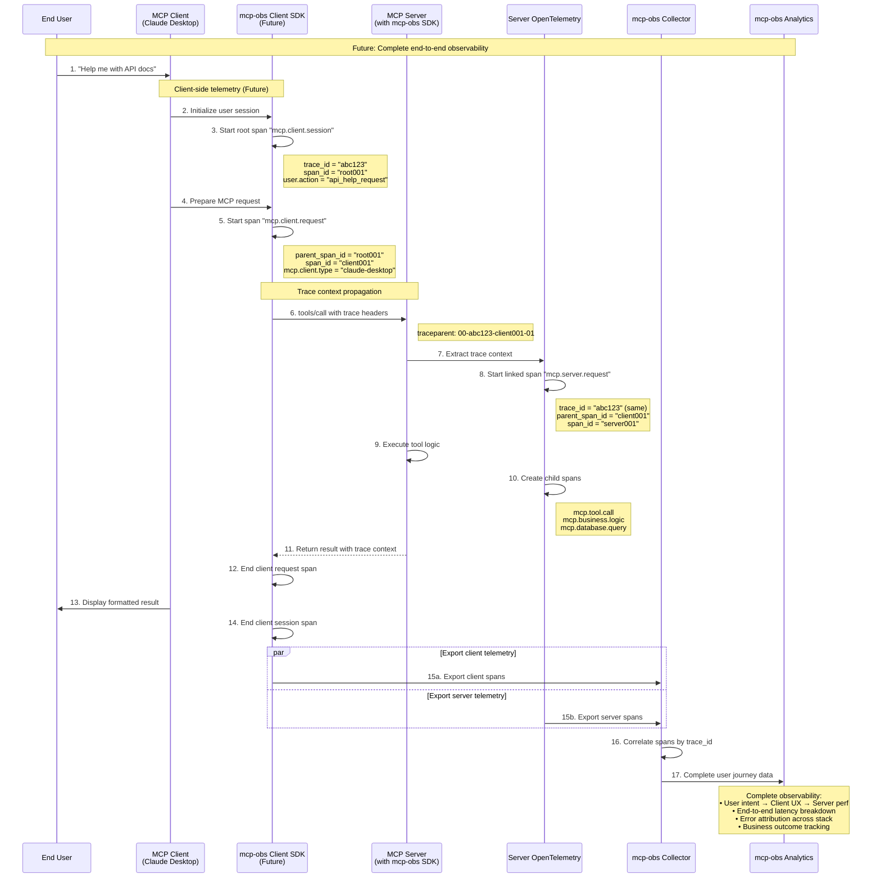
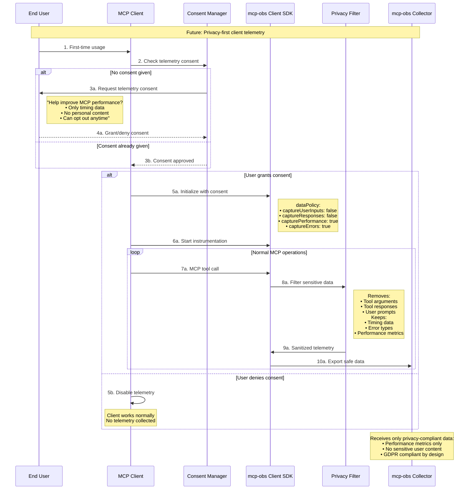

# mcp-obs OpenTelemetry Sequence Diagram

## Overview

This document provides detailed sequence diagrams for OpenTelemetry data flow in mcp-obs, showing the complete telemetry pipeline from MCP server instrumentation to customer observability platforms.

**Current Implementation Scope**: MCP Server-side telemetry only
**Future Scope**: End-to-end telemetry including MCP clients

---

## Current Implementation: Server-Side Telemetry

### Sequence 1: Customer Onboarding & MCP Server Setup



### Sequence 2: API Key Management & Telemetry Setup



### Sequence 3: API Key Validation During Telemetry Export



### Sequence 2: Runtime Telemetry Capture & Export



### Sequence 3: Authentication Context Integration



### Sequence 4: Error Handling & Circuit Breaking



---

## Future Implementation: End-to-End Telemetry

### Sequence 5: Client + Server Distributed Tracing (Future)



### Sequence 6: Privacy-Compliant Client Telemetry (Future)



---

## Data Flow Summary

### Current Implementation Flow
```
MCP Tool Call → Auto-Instrumentation → OpenTelemetry → mcp-obs Collector → PostgreSQL
                                                                         → (Future: Customer Platform)
```

### Future End-to-End Flow
```
User Action → Client Telemetry → Trace Context → Server Telemetry → mcp-obs Collector → Analytics Dashboard
                                      ↓                                      ↓
                               Privacy Filter                        Customer Platform
```

## Key Implementation Notes

### Performance Guarantees
- **Non-blocking exports**: Telemetry never blocks MCP operations
- **Circuit breaker**: Graceful degradation when mcp-obs unavailable
- **Async processing**: All telemetry operations are asynchronous
- **Minimal overhead**: <5% performance impact target

### Security & Privacy
- **API key authentication**: All exports secured with organization-scoped keys
- **Privacy-first**: Client telemetry (future) never captures sensitive content
- **User consent**: GDPR-compliant opt-in model for client instrumentation
- **Data minimization**: Only essential performance data collected

### Observability Benefits
- **Complete user attribution**: Link anonymous usage to authenticated users
- **Performance insights**: End-to-end latency breakdown per user/tool
- **Business intelligence**: Tool popularity, user engagement patterns
- **Proactive monitoring**: Error detection and performance degradation alerts